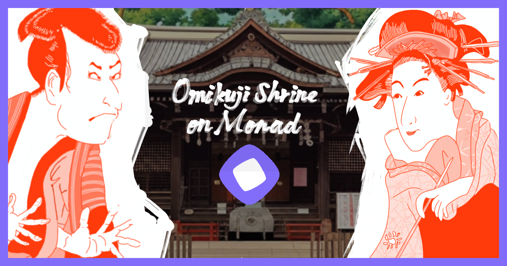

# 🏮 Omikuji Shrine on Monad



*Digital Fortune Telling on Monad Network - Draw your fortune and mint unique NFTs inspired by classical Japanese art*

## 🎋 About

Omikuji Shrine on Monad is a Web3 fortune-telling dApp that combines traditional Japanese omikuji (fortune slips) with NFT technology on the Monad network. Draw your fortune and receive a unique NFT featuring masterpieces of classical Japanese art.

## ✨ Features

- 🎭 **Traditional Omikuji Experience**: Seven different fortune types with authentic Japanese meanings
- 🖼️ **Classical Art NFTs**: Each fortune is paired with famous Japanese artworks from master artists
- 🎵 **Atmospheric BGM**: Traditional Japanese music enhances the spiritual experience
- 💰 **Affordable Minting**: Only 0.1 MON per fortune draw
- 🔗 **Seamless Wallet Integration**: RainbowKit-powered wallet connectivity
- 📱 **Mobile Responsive**: Beautiful design across all devices
- 🌐 **Monad Network**: Built on the fast and efficient Monad blockchain

## 🎨 Fortune Types & Artwork Mapping

| Fortune Type | Rarity | Probability | Featured Artwork | Artist |
|--------------|--------|-------------|------------------|---------|
| **Super Ultra Great Blessing (大大大吉)** | 🌟🌟🌟🌟🌟🌟 | 0.5% | Fine Wind, Clear Morning | Katsushika Hokusai |
| **Ultra Great Blessing (大大吉)** | 🌟🌟🌟🌟🌟 | 1.5% | The Great Wave off Kanagawa | Katsushika Hokusai |
| **Great Blessing (大吉)** | 🌟🌟🌟🌟 | 5.0% | Minamoto no Yoshitsune on Horseback | Isoda Koryūsai |
| **Middle Blessing (中吉)** | 🌟🌟🌟 | 10.0% | Matsumoto Yonesaburo as Shinobu | Tōshūsai Sharaku |
| **Small Blessing (小吉)** | 🌟🌟 | 20.0% | Kabuki Actor Ōtani Oniji III | Tōshūsai Sharaku |
| **Blessing (吉)** | 🌟 | 30.0% | Chinese Lions (Karajishi) | Kanō Eitoku |
| **Minor Blessing (末吉)** | ⭐ | 33.0% | Wind God and Thunder God | Tawaraya Sōtatsu |

## 🎯 Special Features

- **Self-Mint Completion System**: Track your personally minted fortune types (0-7)
- **Completion Rewards**: Special recognition for collecting all 7 fortune types through self-minting
- **Lucky Numbers**: Special animations and enhanced fortunes for tokens #777 and #7777
- **Art Credits**: Complete attribution to museums and Wikipedia sources
- **Social Sharing**: Share your fortune results directly to X/Twitter
- **Unlimited Supply**: No maximum cap on NFT minting
- **Real-time Counter**: See total minted count in real-time

## 🛠️ Technology Stack

- **Frontend**: React + TypeScript + Vite
- **Wallet Integration**: RainbowKit + Wagmi
- **Blockchain**: Monad Network + Localhost testing
- **Smart Contracts**: Solidity + Hardhat
- **Storage**: IPFS via Pinata
- **Deployment**: Vercel

## 🚀 Getting Started

### Prerequisites
- Node.js 18+
- MetaMask or compatible wallet
- MON tokens for minting

### Local Development
```bash
# Clone the repository
git clone https://github.com/kenmori/omikuji-shrine-on-monad.git

# Install dependencies
npm install

# Start local Hardhat node
npm run node

# Deploy contracts (in another terminal)
npm run deploy:local

# Start development server
npm run dev
```

### Adding Test MON to MetaMask
1. Import one of these test private keys to MetaMask:
   - `0xac0974bec39a17e36ba4a6b4d238ff944bacb478cbed5efcae784d7bf4f2ff80`
2. Switch to Localhost network (Chain ID: 31337)
3. You'll have 10,000 MON for testing

## 🎨 Art Attribution

All artworks featured in this project are inspired by masterpieces in the public domain:
- Museum collections (MFA Boston, Metropolitan Museum)
- Wikipedia Commons
- Traditional Japanese art heritage

**Important**: Fortune results are randomly assigned and not related to the artistic or historical value of the featured artworks.

## 🎵 Credits

- **BGM**: "Hurusato" by [@hiroseyuki113](https://x.com/hiroseyuki113) - [Original Source](https://original-bgm.booth.pm/items/3784404)
- **Artwork**: Classical Japanese masters (Hokusai, Sharaku, Sōtatsu, etc.)
- **Creator**: [@d_omajime](https://x.com/d_omajime)

## 🤝 Contributing

We welcome contributions! Please feel free to:

- 🐛 **Report Issues**: Found a bug? [Open an issue](https://github.com/kenmori/omikuji-shrine-on-monad/issues)
- 💡 **Feature Requests**: Have an idea? [Create a feature request](https://github.com/kenmori/omikuji-shrine-on-monad/issues)
- 🔀 **Pull Requests**: Want to contribute code? [Submit a PR](https://github.com/kenmori/omikuji-shrine-on-monad/pulls)

### Areas for Contribution
- UI/UX improvements
- Additional fortune types
- Mobile optimization
- Performance enhancements
- Documentation improvements
- Localization (multiple languages)

## 📄 License

This project is open source. Please respect the original artists and maintain proper attribution when using the artwork references.

## 🔗 Links

- **Live Demo**: [Coming Soon on Vercel]
- **GitHub**: [omikuji-shrine-on-monad](https://github.com/kenmori/omikuji-shrine-on-monad)
- **Creator**: [@d_omajime](https://x.com/d_omajime)
- **Monad Network**: [monad.xyz](https://monad.xyz)

---

*May your fortune bring you great blessings! 🙏*